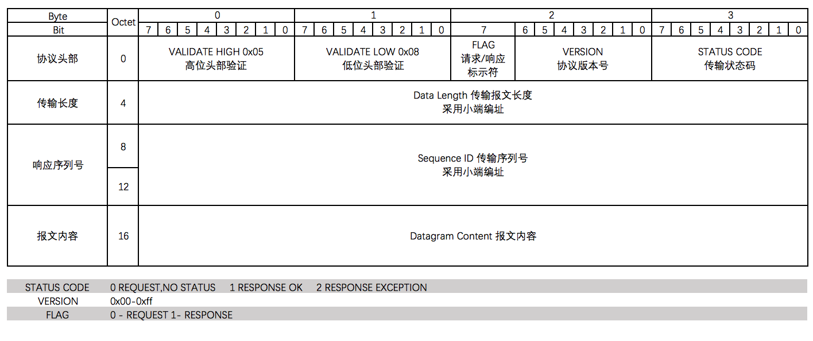

# dubbo_service_mesh_agent

2018 阿里巴巴中间件挑战赛 - Service Mesh Agent 设计

### 调用方式
通讯环节 | 远程通讯协议 
------------- | -------------
Client => Consumer | HTTP协议
Consumer => Consumer Agent | HTTP协议
Consumer Agent => Provider Agent | 自定义协议
Provider Agent => Provider | Dubbo协议
Provider => Provider Agent | Dubbo协议
Provider Agent => Consumer Agent | 自定义协议
Consumer Agent => Consumer | HTTP协议
Consumer => Client | HTTP协议

### 自定义协议

### 使用的第三方依赖
- Netty
- Spring Boot

### Benchmark

假定Prodvider业务逻辑处理时延是50ms，docker集群内有以下节点：
- Consumer节点 -通过SpringBoot暴露服务供客户端调用
- Provider Large节点 - SpringBoot+Dubbo提供服务，启动参数：-Xms3G -Xmx3G 
- Provider Medium节点 - SpringBoot+Dubbo提供服务，启动参数：-Xms2G -Xmx2G 
- Provider Small 节点 - SpringBoot+Dubbo提供服务，启动参数：-Xms1G -Xmx1G 
- ETCD 节点 - 服务器注册与服务发现

使用wrk调用Consumer进行测试，测试结果
- Online（天池测评平台）：最高 5099 qps
- Local （阿里云ECS，4C8G）： 最高 7100 qps
